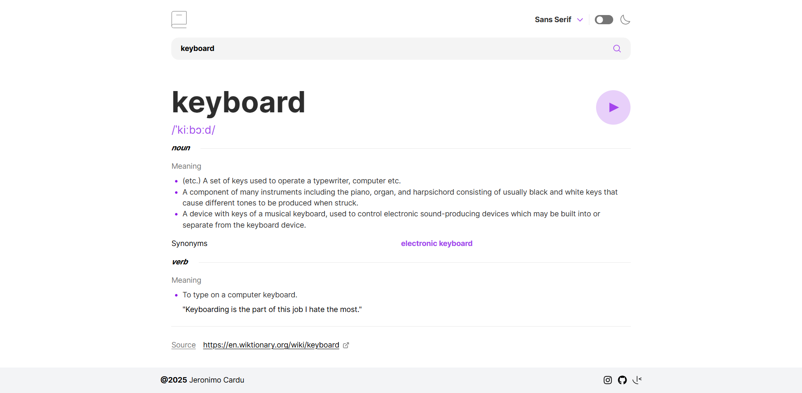
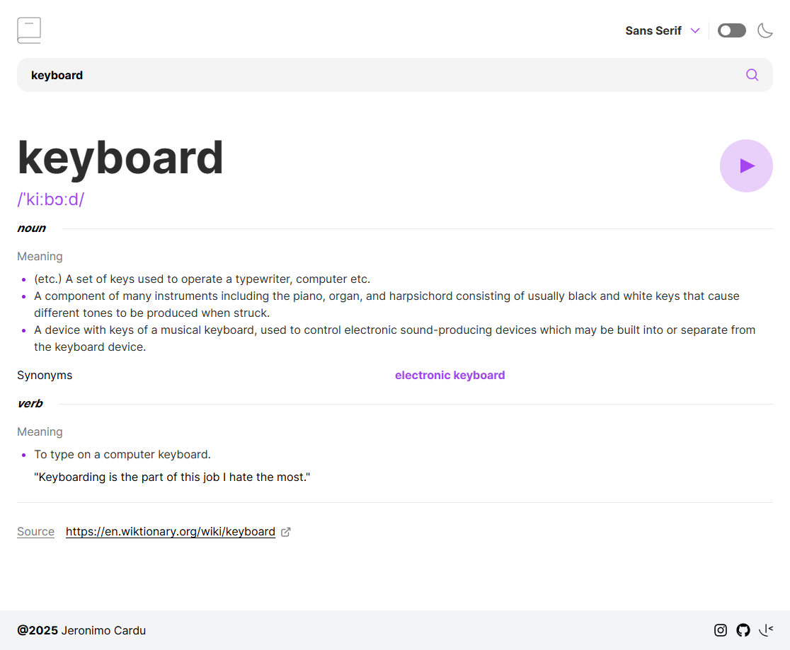
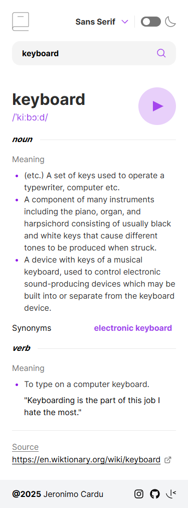

# Frontend Mentor - Dictionary web app solution

This is a solution to the [Dictionary web app challenge on Frontend Mentor](https://www.frontendmentor.io/challenges/dictionary-web-app-h5wwnyuKFL). Frontend Mentor challenges help you improve your coding skills by building realistic projects.

## Table of contents

- [Overview](#overview)
  - [The challenge](#the-challenge)
  - [Screenshot](#screenshot)
  - [Links](#links)
  - [Built with](#built-with)
- [Author](#author)

## Overview

### The challenge

Users should be able to:

- Search for words using the input field
- See the Free Dictionary API's response for the searched word
- See a form validation message when trying to submit a blank form
- Play the audio file for a word when it's available
- Switch between serif, sans serif, and monospace fonts
- Switch between light and dark themes
- View the optimal layout for the interface depending on their device's screen size
- See hover and focus states for all interactive elements on the page
- **Bonus**: Have the correct color scheme chosen for them based on their computer preferences. _Hint_: Research `prefers-color-scheme` in CSS.

### Screenshot

### Links

- Live Site URL: [URL](https://dictionary-web-murex.vercel.app/)

## My process

### Built with

- Semantic HTML5 markup
- CSS custom properties
- Flexbox
- CSS Grid
- Mobile-first workflow
- [React](https://reactjs.org/) - JS library
- [Next.js](https://nextjs.org/) - React framework
- [Styled Components](https://styled-components.com/) - For styles
- [Vite](https://vite.dev/)
- [TailwindCSS](https://tailwindcss.com/)
- [Zustand](https://zustand.docs.pmnd.rs/getting-started/introduction)
- [Tanstack](https://tanstack.com/)
- [React-icons](https://react-icons.github.io/react-icons/) - for the footer
- [React-router](https://reactrouter.com/)

## Author

- Frontend Mentor - [@JeronimoCardu](https://www.frontendmentor.io/profile/JeronimoCardu)
- Instagram - [@jeronimocardu](https://www.instagram.com/jeronimocardu/)
